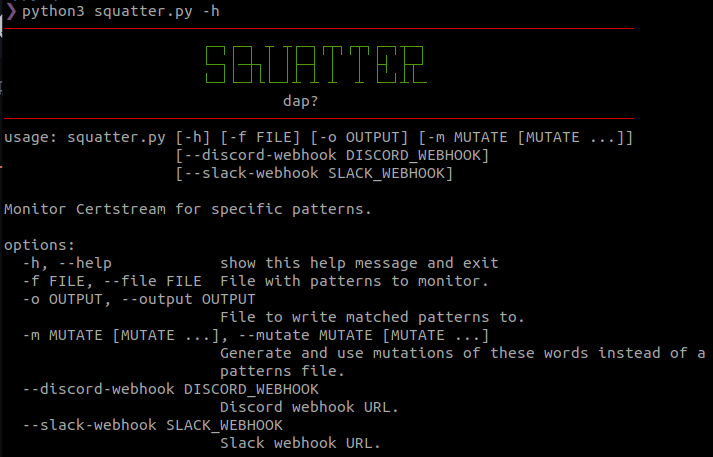

# Squatter

Squatter is a tool for monitoring Certstream for specific patterns and writing the matched domains to a file. It can also send the matched domains to Discord or Slack channels using webhooks.



## Installation

To install Squatter, follow these steps:

1. Clone the repository:

   ```
   git clone https://github.com/your-username/squatter.git
   ```

2. Navigate to the project directory:

   ```
   cd squatter
   ```

3. (Optional) Create a virtual environment:

   ```
   python3 -m venv venv
   source venv/bin/activate
   ```

4. Install the required dependencies:

   ```
   pip install -r requirements.txt
   ```

## Usage

To use Squatter, execute the `squatter.py` script with the desired options. Here are the available options:

```
python3 squatter.py [-h] [-f FILE] [-o OUTPUT] [-m MUTATE [MUTATE ...]] [--discord-webhook DISCORD_WEBHOOK] [--slack-webhook SLACK_WEBHOOK]
```

- `-f FILE, --file FILE`: Path to a file with patterns to monitor.
- `-o OUTPUT, --output OUTPUT`: File to write matches to (default: `matches.txt`).
- `-m MUTATE [MUTATE ...], --mutate MUTATE [MUTATE ...]`: Generate and use mutations of the provided words instead of a patterns file.
- `--discord-webhook DISCORD_WEBHOOK`: Discord webhook URL.
- `--slack-webhook SLACK_WEBHOOK`: Slack webhook URL.

### Examples

1. Monitor Certstream using a patterns file:

   ```
   python3 squatter.py -f patterns.txt
   ```

2. Generate and monitor mutations of words:

   ```
   python3 squatter.py -m word1 word2 word3
   ```

3. Monitor Certstream and send matched patterns to a Discord channel:

   ```
   python3 squatter.py -f patterns.txt --discord-webhook https://your-discord-webhook-url
   ```

4. Monitor Certstream and send matched patterns to a Slack channel:

   ```
   python3 squatter.py -f patterns.txt --slack-webhook https://your-slack-webhook-url
   ```

